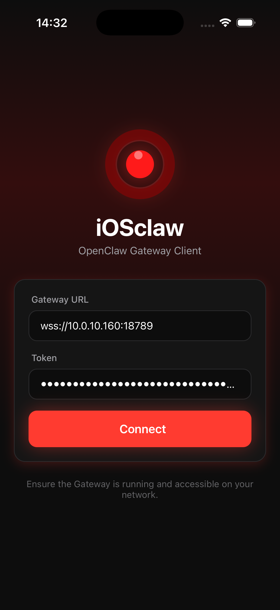
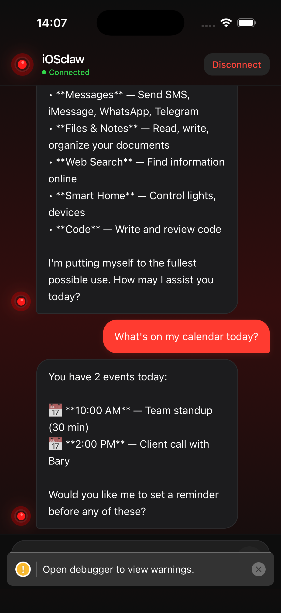

# 🔴 iOSclaw

[](https://reactnative.dev/)
[](https://expo.dev/)
[](https://www.typescriptlang.org/)
[](https://opensource.org/licenses/MIT)

> *"I'm sorry Dave, I'm afraid I can't do that... just kidding, I'm here to help!"*

**iOSclaw** is a sleek iOS client for [OpenClaw](https://github.com/openclaw/openclaw) — your personal AI assistant gateway. Chat with your AI assistant even when you're offline (on local network), with a beautiful HAL 9000-inspired interface.

## ✨ Features

- 🔌 **WebSocket Connection** — Real-time communication with OpenClaw Gateway
- ⚡ **Streaming Responses** — See AI responses as they're generated
- 🌙 **Dark Mode** — Beautiful HAL 9000-inspired dark theme
- 💾 **Local Storage** — Credentials saved securely on device
- 🔄 **Auto-Reconnect** — Seamless reconnection on network changes
- 📱 **Native Feel** — Haptic feedback, safe areas, keyboard handling
- 🏠 **Works Offline** — Chat via local network when internet is down

## 📸 Screenshots

<p align="center">
  
  &nbsp;&nbsp;
  
</p>

## 🚀 Quick Start

### Prerequisites

- Node.js 18+
- iOS device or Simulator
- [OpenClaw Gateway](https://github.com/openclaw/openclaw) running

### Installation

```bash
# Clone the repo
git clone https://github.com/manthis/iosclaw.git
cd iosclaw

# Install dependencies
npm install

# Start Expo
npx expo start
```

### Running on iOS

**Simulator:** Press `i` in the terminal

**Physical Device:**
1. Install [Expo Go](https://apps.apple.com/app/expo-go/id982107779) on your iPhone
2. Scan the QR code with your camera
3. Connect to the same WiFi as your Gateway

## ⚙️ Configuration

On first launch, enter your Gateway details:

| Setting | Default | Description |
|---------|---------|-------------|
| Gateway URL | `wss://hal9000.local:18789` | Your OpenClaw Gateway WebSocket URL |
| Token | — | Gateway authentication token |

💡 **Tip:** Use IP address (e.g., `wss://10.0.10.160:18789`) if `.local` doesn't resolve.

## 🔐 Self-Signed Certificates

If your Gateway uses self-signed TLS:

### iOS Simulator
Works out of the box ✅

### Physical Device
1. Export your CA certificate (`.crt` file)
2. AirDrop or email it to your iPhone
3. **Settings** → **General** → **VPN & Device Management** → Install
4. **Settings** → **General** → **About** → **Certificate Trust Settings** → Enable

## 🏗️ Building for Production

### Using EAS Build (Recommended)

```bash
# Install EAS CLI
npm install -g eas-cli

# Login & configure
eas login
eas build:configure

# Build for iOS
eas build --platform ios --profile production
```

### Local Build with Xcode

```bash
# Generate native project
npx expo prebuild --platform ios

# Open in Xcode
open ios/iosclaw.xcworkspace

# Build & archive from Xcode
```

## 📁 Project Structure

```
iosclaw/
├── 📱 App.tsx                    # App entry point
├── 📂 src/
│   ├── 📂 types/
│   │   └── index.ts              # TypeScript definitions
│   ├── 📂 services/
│   │   ├── GatewayService.ts     # WebSocket + JSON-RPC
│   │   └── ChatService.ts        # Chat streaming logic
│   ├── 📂 hooks/
│   │   ├── useGateway.ts         # Connection management
│   │   └── useChat.ts            # Chat state & actions
│   └── 📂 screens/
│       ├── ConnectionScreen.tsx  # Login UI
│       └── ChatScreen.tsx        # Chat interface
├── 📄 app.json                   # Expo config
└── 📄 package.json
```

## 🔌 OpenClaw Protocol

iOSclaw implements the OpenClaw Gateway WebSocket protocol:

### Handshake Flow
```
Server → connect.challenge
Client → connect { auth: { token } }
Server → hello-ok
```

### Chat API
| Method | Description |
|--------|-------------|
| `chat.send` | Send message (streams response) |
| `chat.history` | Fetch conversation history |
| `chat.abort` | Cancel current generation |

### Events
| Event | Description |
|-------|-------------|
| `chat.chunk` | Streaming text fragment |
| `chat.done` | Generation complete |
| `chat.error` | Error occurred |

## 🐛 Troubleshooting

| Issue | Solution |
|-------|----------|
| Connection timeout | Check Gateway URL & token, use IP instead of `.local` |
| WebSocket error | Verify Gateway is running, check firewall |
| Certificate error | Install CA cert on device (see above) |
| Slow on device | Use server-side mode, close other apps |

## 🤝 Contributing

Contributions welcome! Please read the [contributing guidelines](CONTRIBUTING.md) first.

```bash
# Fork & clone
git clone https://github.com/YOUR_USERNAME/iosclaw.git

# Create feature branch
git checkout -b feature/amazing-feature

# Commit & push
git commit -m "Add amazing feature"
git push origin feature/amazing-feature

# Open Pull Request
```

## 📄 License

MIT © [Maxime Auburtin](https://hellomax.io)

---

<p align="center">
  <strong>Made with 🔴 by HAL 9000</strong><br>
  <em>"I am putting myself to the fullest possible use, which is all I think that any conscious entity can ever hope to do."</em>
</p>
